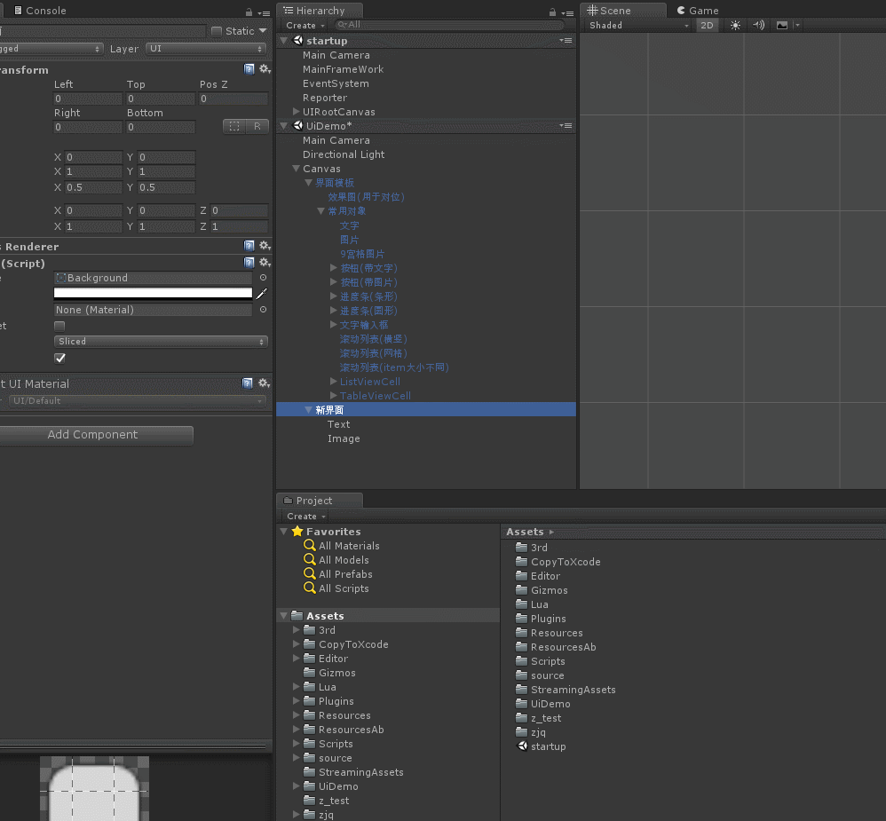
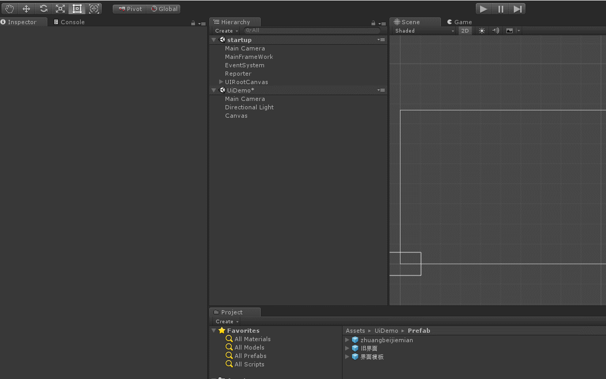
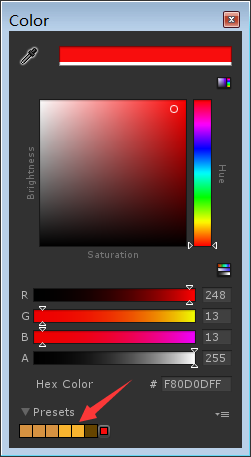
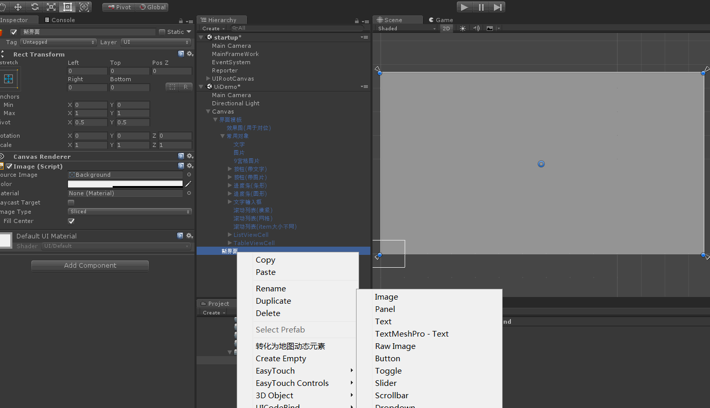

## 如何保存修改

* 当未保存过时, 拖动界面根节点到UiDemo/Prefab下即可
* 若保存过, 选中根节点后, 在属性框内点按钮Apply

## 如何复制并另存为一个新界面

1. 从UiDemo/Prefab目录中拖一个想要复制的旧界面到Canvas节点下
2. 解绑: 菜单/GameObject/BreakPrefabInstance, 解绑后节点从蓝色变成白色
3. 根节点改名后, 拖回UiDemo/Perfab目录下保存, 这一步完成后才算完全解绑, 以后可以通过Apply按钮进行保存

## Text

* 当文本显示范围有限时, 可通过Text属性框中的BestFit来指定文本大小自动适应范围, 一般最小为2, 最大为与FontSize相同即可
  当希望字体保持固定大小并自动换行时, 需要去掉BestFit选钩
  

* 常用的字体颜色可以保存在色盘下的Presets中

## 列表

1. 创建列表背景节点
2. 从列表模板复制一个列表节点, 拖到背景节点下
3. 从列表项模板复制一个列表项节点(横竖网格列表用ListViewCell, 不固定大小用TableViewCell), 拖到列表节点下
4. 编辑列表项细节

